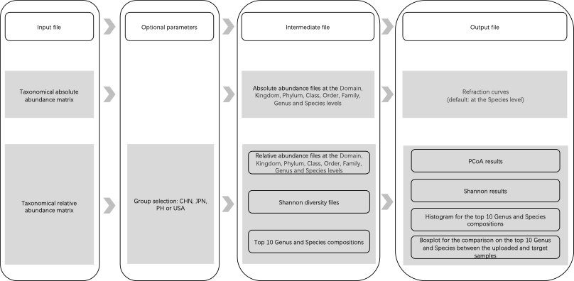
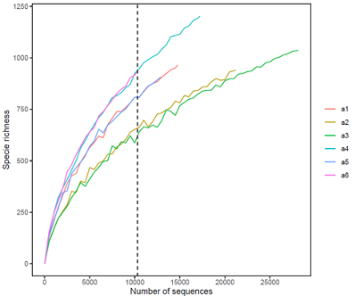
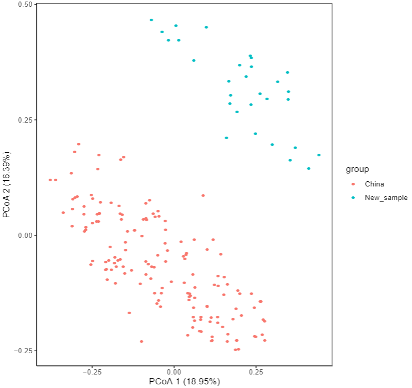
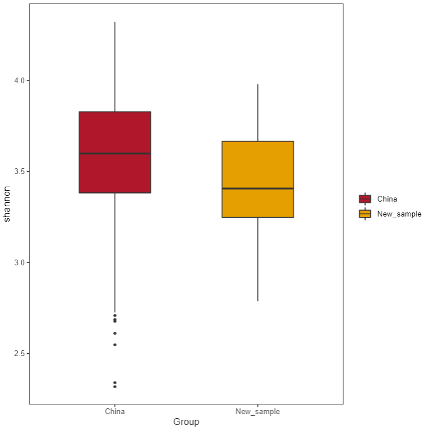
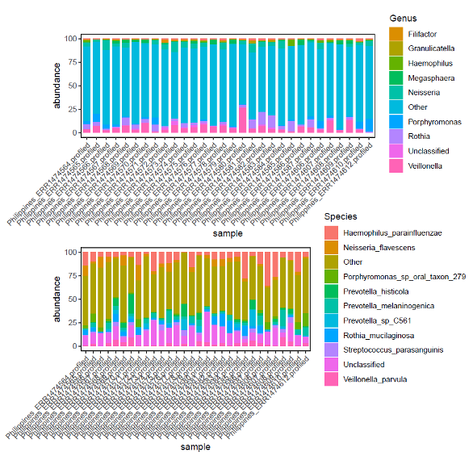
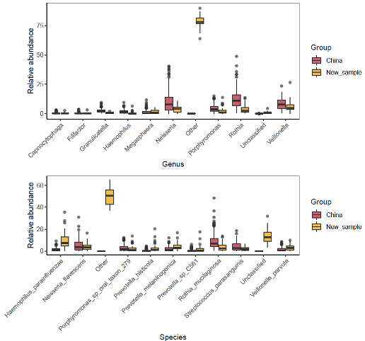

## Pipeline Overview

## Input file

**1. Taxonomical absolute abundance file (Required)**

Data mount is important for metagenomic analysis, while insufficient data mount could not reflect the real microbial compositions in samples, and decrease the credibility of the analysis results. Relying on the absolute abundances from the uploaded file, the refraction curve of species richness will help us to evaluate the data adequacy.

Here is the format for the uploaded file with absolute abundances of samples.

| ID | sample1 |	sample2	| sample3	| sample4	| sample5 |
| :----- | :----: | :----: | :-----: | :----: | :----: |
|Bacteria|Actinobacteria|748161|	730569|	250409	|520115|1524850|
|Bacteria\|Actinobacteria\|Actinobacteria	|748161|	730569	|250409|	520115	|1524850|
|Bacteria\|Actinobacteria\|Actinobacteria\|Actinomycetales|	746994	|710934	|233306|	350787|	1431916|
|Bacteria\|Actinobacteria\|Actinobacteria\|Actinomycetales\|Actinomycetaceae	|84841	|140445|	22330	|160848	|468746|
|Bacteria\|Actinobacteria\|Actinobacteria\|Actinomycetales\|Actinomycetaceae\|Actinomyces|	84841	|140445|	22330|	160848	|468746|
|Bacteria\|Actinobacteria\|Actinobacteria\|Actinomycetales\|Actinomycetaceae\|Actinomyces\|Actinomyces_cardiffensis	|2161|	0	|3517|	0	|622

**2.	Taxonomical relative abundance file (Required)**

With the taxonomic annotation results obtained from MetaPhlan2, the following analysis will be executed.

a) Based on the taxonomic annotation results, PCoA analysis will be performed between the uploaded samples and the target samples in the oral microbiome database, while the Bray-Curtis distances among samples will be calculated.

b)	The Shannon diversity will be calculated for the uploaded samples, and compared to the samples from the target region.

c)	The top 10 genus and species will be selected from the uploaded samples, and be used for the construction of histogram.

d)	For the top 10 genus and species obtained from the uploaded samples, comparison on the relative abundances will be executed between the uploaded and target samples.

Here is the example of the taxonomic annotation results from MetaPhlan2.

| ID | sample1 |	sample2	| sample3	| sample4	| sample5 |
| :----- | :----: | :----: | :-----: | :----: | :----: |
|Bacteria|	100|	100|	100|	100|	100|
|Bacteria\|Actinobacteria|	7.481617|	7.305698|	2.504091|	5.201153	|15.24851|
|Bacteria\|Actinobacteria\|Actinobacteria|	7.481617|	7.305698|	2.504091|	5.201153	|15.24851|
|Bacteria\|Actinobacteria\|Actinobacteria\|Actinomycetales	|7.469947	|7.109345	|2.333063	|3.507874|	14.31916|
|Bacteria\|Actinobacteria\|Actinobacteria\|Actinomycetales\|Actinomycetaceae|	0.848411|	1.404457|	0.223303|	1.608484|	4.687461|
|Bacteria\|Actinobacteria\|Actinobacteria\|Actinomycetales\|Actinomycetaceae\|Actinomyces|	0.848411	|1.404457	|0.223303	|1.608484|	4.687461|
|Bacteria\|Actinobacteria\|Actinobacteria\|Actinomycetales\|Actinomycetaceae\|Actinomyces\|Actinomyces_cardiffensis|	0.021611	|0|	0.035178|	0	|0.006225|

**3.	Target region (Optional)**

The target region needs to be selected during the analysis, such as CHN (China), JPN (Japanese), PH (Philippines) and USA (American). Oral samples from CHN group will be selected by default.

## Output file

All the output files can be downloaded from the platform when the task is completed.

**1. Refraction curves**

In this plot, the rarefaction curves for all samples are drawn with the species richness, and data mount is sufficient for the following analysis when the refraction curves reach the plateau period. X and Y coordinates represent the number of reads and the number of species respectively.

**2. PCoA results**

With Bray-curtis distances, the differences between the uploaded and the target samples (CHN, JPN, PH or USA group) are exhibited by the PCoA analysis. The target and uploaded samples are marked by different colors.

**3. Shannon results**

Based on the taxonomical compositions at the species level, the Shannon diversity are calculated for all the uploaded samples. The comparison on the Shannon diversity is also executed between the target and the uploaded groups, and the groups are marked by different colors.

**4.	Histogram for the top 10 Genus and Species compositions**

Top 10 genus and species are selected from the uploaded samples respectively, while other genus and species are defined as other. Then, the taxonomical compositions are drawn for the uploaded samples at the genus and species levels respectively.

**5.	Boxplot for the comparison on the top 10 Genus and Species between the uploaded and target samples**

With the top 10 genus and species selected from the uploaded samples, the comparison is executed between the uploaded and the target samples.