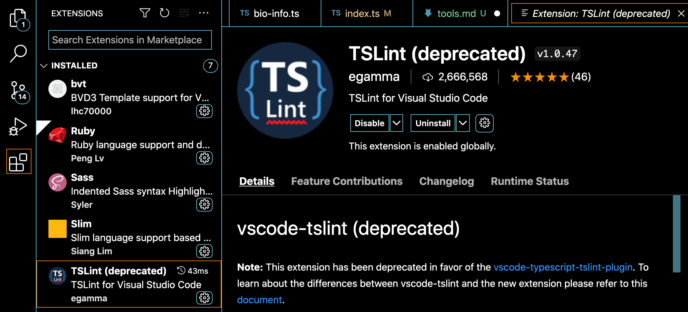
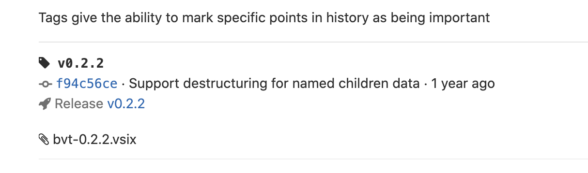
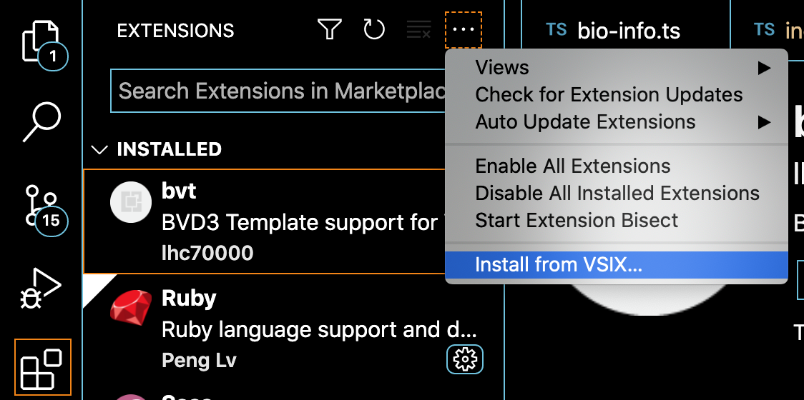

## Git UI

[Fork](https://git-fork.com/) is recommended for your team management. You may also use command or other UI if you know how.

## Developer's tools

[Visual studio code](https://code.visualstudio.com/) has lots of extensions for different coding language and is strongly recommended as the code editor. 

### Used extensions:
- **tslint(deprecated)** for typescript, install it in the vscode extension market

- **bvt** for Oviz template. download the vsix file [here](https://delta.cs.cityu.edu.hk/lhc/bvt-vscode/-/tags) and import it into your vs code extensions. 
    
    